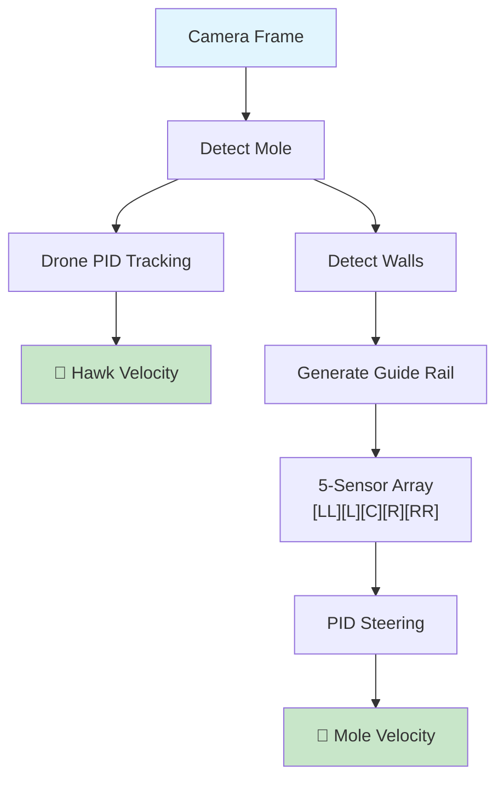

<p align="center">
  
</p>

<h1 align="center">Autonomous Maze Navigation</h1>

<p align="center">
  <em>A vision-based autonomous robot navigation system</em><br/>
  <strong>🥇 Winner — IEEE Robotrix 2025-26 Final Hackathon</strong>
</p>

<p align="center">
  
  
  
</p>

<p align="center">
  <a href="#the-challenge">Challenge</a> •
  <a href="#demo">Demo</a> •
  <a href="#technical-solution">Solution</a> •
  <a href="#quick-start">Quick Start</a>
</p>

---

## The Challenge

> **Navigate a blind rover through a maze using only drone vision — no GPS, no coordinates, no cheating.**

<table>
<tr>
<td width="50%">

### 🤖 The Setup
| Actor | Role |
|-------|------|
| **The Mole** | Ground rover (blind, no sensors) |
| **The Hawk** | Drone with downward camera |
| **The Maze** | 15m × 15m, red walls |

</td>
<td width="50%">

### 🚫 The Rules
| Constraint | What it means |
|------------|---------------|
| No `getPosition()` | Can't ask simulator for location |
| No globals | No cheating with shared state |
| 512×512 FOV | Can only see small section |
| Real-time | Must run live, no pre-planning |

</td>
</tr>
</table>

---

## Demo

<p align="center">
  <a href="./Final%20Cleared.mp4">
    
  </a>
</p>

<p align="center">
  <sub>📹 <a href="./Final%20Cleared.mp4"><b>Final Cleared.mp4</b></a> — Complete maze navigation in real-time</sub>
</p>

---

## Technical Solution

Our solution implements a **Multi-State Visual Wall Follower** using computer vision and control theory — a completely vision-based approach that doesn't rely on any position data.

### Key Innovation: Virtual Guide Rail + 5-Sensor Array

Instead of tracking absolute position, we generate a **virtual guide rail** from camera images and follow it using a simulated IR sensor array.



### Core Components

| Component | Purpose | Technique |
|-----------|---------|-----------|
| **Mole Detection** | Track rover position in frame | HSV thresholding (yellow marker) + contour detection |
| **Drone Tracking** | Keep mole centered | Dual-axis PID with anti-windup |
| **Wall Detection** | Segment maze walls | Dual HSV ranges (red hue wraparound) |
| **Guide Rail** | Generate followable path | Closest-point wall selection + morphological fillet |
| **5-Sensor Array** | Line following | Virtual IR sensors in reverse-U layout |
| **Heading Estimation** | Track orientation | Hybrid odometry + visual sensor fusion (98%/2%) |
| **State Machine** | Handle edge cases | `WALL_FOLLOW` ↔ `LOOP_ESCAPE` |

---

## Key Design Decisions

### 1. Closest-Point vs Centroid Wall Selection

**Problem:** Centroid-based selection jumps between walls at corners.

**Solution:** Sample a point to the rover's RIGHT and find the nearest wall contour.

```python
# Sample point 100px to the right of mole
sample_x = int(cx + right_x * 100)
sample_y = int(cy + right_y * 100)

# Find wall contour closest to this point
for contour in wall_contours:
    dist = abs(cv2.pointPolygonTest(contour, (sample_x, sample_y), True))
    if dist < best_distance:
        best_contour = contour
```

### 2. Morphological Fillet (Smooth Corners)

```python
# Dilate + erode creates naturally rounded corners
dilate_kernel = cv2.getStructuringElement(cv2.MORPH_ELLIPSE, (offset*2, offset*2))
dilated = cv2.dilate(wall_mask, dilate_kernel)

erode_kernel = cv2.getStructuringElement(cv2.MORPH_ELLIPSE, (radius*2, radius*2))
filleted = cv2.erode(dilated, erode_kernel)
```

### 3. Hybrid Heading Estimation

```python
# Complementary Filter: 98% Odometry, 2% Vision
alpha = 0.98
new_heading = alpha * odometry_heading + (1.0 - alpha) * visual_heading
```

> High odometry weight = smooth motion | Low vision weight = eliminates drift

### 4. Weighted 5-Sensor Array

```python
SENSOR_ARRAY = [
    {'name': 'FAR_L',  'weight':  2.3},  # Strong left turn
    {'name': 'LEFT',   'weight':  1.2},  # Mild left turn
    {'name': 'CENTER', 'weight':  0.0},  # No correction
    {'name': 'RIGHT',  'weight': -1.2},  # Mild right turn
    {'name': 'FAR_R',  'weight': -2.3},  # Strong right turn
]
```

---

## Repository Structure

```
Robotrix-26/
├── task_submission.py                    # ✅ Winning solution
├── approach_explanation.txt              # Technical writeup
├── Final Cleared.mp4                     # Competition submission video
├── Robotrix 2026 Problem Statement.pdf   # Official problem statement
│
└── Approach 1 - wall follow logic/       # Alternative approach (didn't work)
    ├── explanation.md             
    ├── World.ttt                         # CoppeliaSim scene
    ├── task14_final.py            
    └── all code files-iterations/        # 18 iterations of development
```

---

## Quick Start

### Prerequisites

- CoppeliaSim (with ZeroMQ Remote API)
- Python 3.8+

### Installation

```bash
git clone https://github.com/YOUR_USERNAME/Robotrix-26.git
cd Robotrix-26
pip install numpy opencv-python coppeliasim-zmqremoteapi-client
```

### Running

```bash
# 1. Open CoppeliaSim with the maze scene
# 2. Run the solution
python task_submission.py
```

---

## Performance

| Metric | Value |
|--------|-------|
| **Result** | 🏆 **1st Place** |
| **Maze Size** | 15m × 15m |
| **Processing** | Real-time |
| **Key Feature** | Fully vision-based, no position data |

---

## Approach Evolution

### Approach 1: Discrete Turn Wall Following ❌

Traditional wall-following with discrete 90° turns and reference frame transformations.

- **Issue:** Reference frame confusion between drone (global XY) and rover (local frame)
- **18 iterations** documented in `Approach 1 - wall follow logic/`

### Final Approach: Continuous Guide Rail Following ✅

Vision-based line following with virtual sensors.

- **Key insight:** Generate a followable "rail" from wall detection, treat it like a line-following problem
- **Result:** Smooth, continuous navigation without reference frame issues

*The final winning solution was developed independently after pivoting from the initial approach.*

---

## Tech Stack

- **Python** — Core implementation
- **OpenCV** — Computer vision (HSV thresholding, morphology, contour detection)
- **NumPy** — Numerical operations
- **CoppeliaSim** — Robot simulation environment
- **ZeroMQ** — Remote API communication

---

## Learnings

- **Sensor Fusion:** Combining wheel odometry with visual heading estimation
- **PID Tuning:** Anti-windup is crucial for real-world performance
- **Computer Vision:** HSV color spaces, morphological operations, contour analysis
- **State Machines:** Handling edge cases (stuck detection, loop escape)
- **Reference Frames:** The importance of coordinate system consistency

---

## Acknowledgments

- **IEEE NITK Student Branch** for organizing Robotrix 2025-26
- **CoppeliaSim** for the simulation platform

---

<p align="center">
  <sub>Built during IEEE Robotrix 2025-26</sub>
</p>